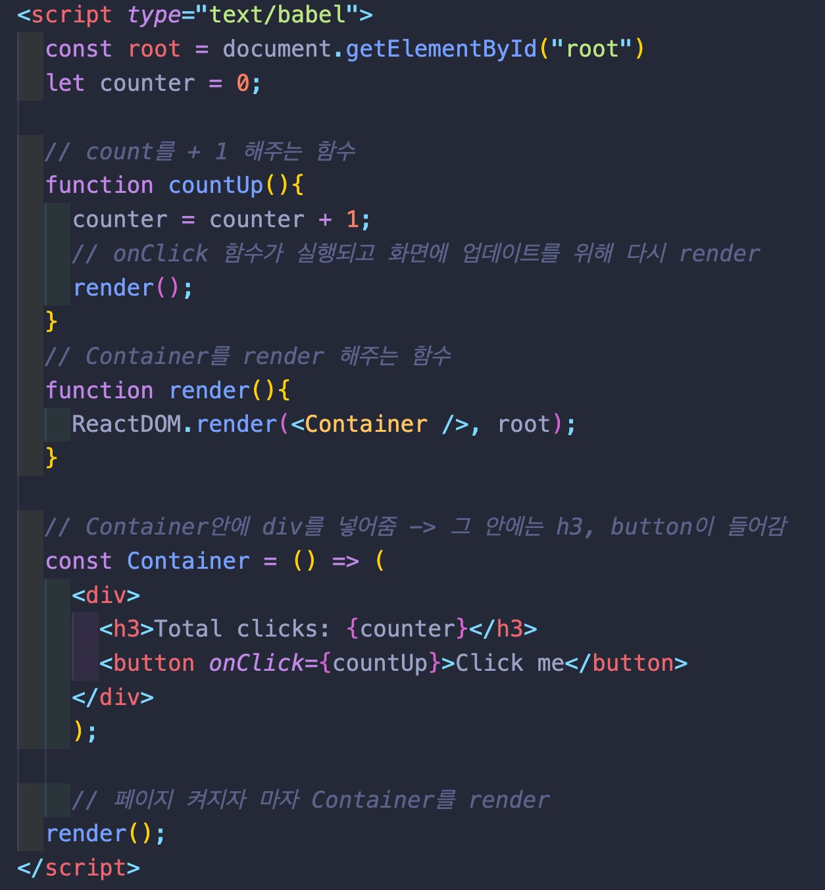
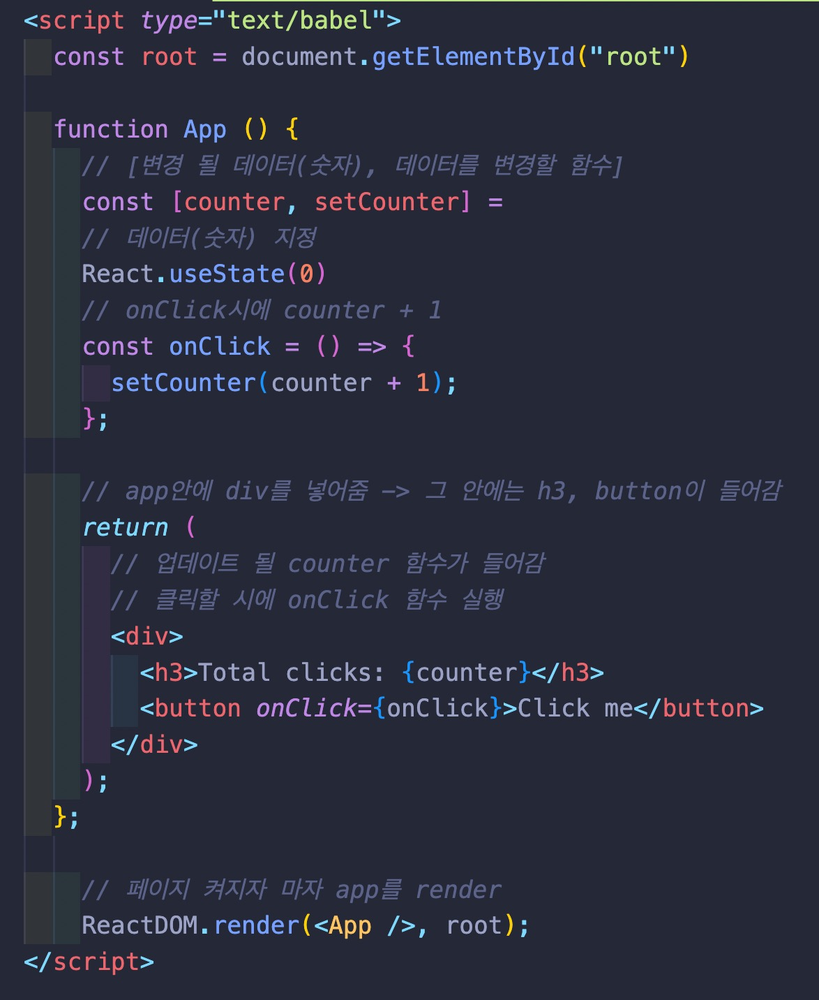

# react-counter
https://jun-isaac.github.io/react-counter/

-----------------
## 🧑🏻‍💻 구현 목표

- [x] React를 활용해서 버튼 클릭시 숫자가 업데이트 됨

-----------------
## 🖼 메인프레임

* 화면에 보이는 버튼을 클릭시 숫자가 업데이트 됩니다.

------------------
## 📕 배운 것

* react 기본 문법을 활용하는 법을 알았다.

  

### ❌ render 함수를 만들어서 화면을 업데이트 할 시

* 함수를 따로 만들어서 업데이트 할 시에 그 함수를 일일히 넣어줘야 해서 손이 많이 가고 실수로 넣지 못했을 경우에 오류가 뜰 확률이 높다.

 

### 💡 React 문법을 활용해 화면을 업데이트 할 시

* React 문법을 활용해서 일일히 코드를 넣지 않아도 자동으로 화면이 업데이트 된다.

  

----

## 사용 라이브러리
|React|
|---|
